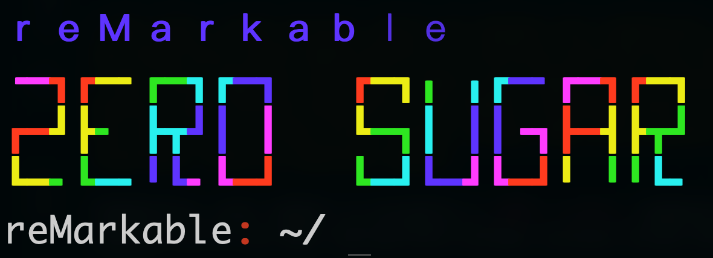
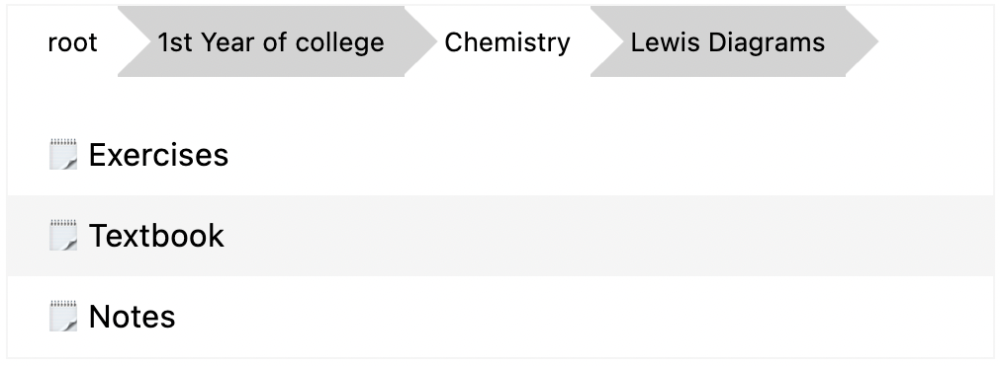

# Wireless web interface for reMarkable 2



This project is a _very_ early prototype of a web interface made for the reMarkable 2 tablet.

As you may know, your reMarkable tablet can store your notes using its internal 6GB flash drive. However, when you want to retrieve your files, you can either:

* Use their cloud service, which can become very expensive, or even impossible, as you need their paid subscription to continue syncing your documents
* Use their USB web interface, where you connect your tablet to your computer, and access a web service hosted on the tablet. By doing this, your computer doesn't see the tablet as a flash drive (like a normal USB stick would) but as a wired network interface (like an ethernet cable).

Thankfully, your tablet is actually a _GNU + Linux_ computer, meaning you can connect to it via SSH, and perform various actions using their terminal.

## What this prototype does
You can access some of your files from a web server hosted on your computer, and navigate your reMarkable 2 file system, to retrieve your data.



_Screenshot of the wireless web interface_

## How it works

This is a node.js server, that serves the main interface. To get the data, the server uses the SSH capability of your tablet, to copy files over [SCP](https://en.wikipedia.org/wiki/Secure_copy_protocol).

### Downloading metadata
In order to not overload the tablet with requests, caching is done only when accessing the `/reload_cache` point of the server. When the user sends this GET request, here's what the server does in the backend:
1. Transfers all `.metadata` files stored in the tablet at `/home/root/.local/share/remarkable/xochitl` and stores them in the `cache/` directory. 
1. It then reads through all the metadata files, and builds a JSON file that is better organised, because it is in a tree format. The JSON file is stored as `cached.json`
### Viewing the file system
The frontend requests the JSON file, and displays the file system that you can easily navigate. It distinguishes between folders and files, and you can even click on files to view them.

When you do so, the server downloads the file in question, stores it in the `cache/` and serves the file to the user

## Limitations
Sadly, the main limitation, is that you cannot view all the files: reMarkable stores your notebooks and annotated PDFs in a proprietary format named "lines format", and whose extension is `.rm` and needs conversion to PDF before you do anything. When you use their USB Web interface, and you download a notebook or annotated PDF, it actually takes some time to generate the PDF file, which is then served to the user.

In the meantime, if you try to download a notebook, it will tell you that Notebooks aren't supported, and if you download an annotated PDF, you'll get the original PDF without annotations.

## Installation 
You will need _node.js_ and their _npm_ package manager.
1. Clone and install the required dependencies by typing this in your terminal:
```
git clone https://github.com/George-Ober/Remarkable-2-Wireless-Web.git
cd Remarkable-2-Wireless-Web/
npm install
```
2. Create a directory at `cache/`
```
mkdir cache
```
3. On your tablet, go to Settings > Help > Copyrights and licences
    *  Here you'll find "copyright notices and software licenses"
    *  On the bottom part of your screen, you will see a password in bold, as well as its local IP address
4. Create a `.env` file where you'll store your tablet's IP and tablet's password:
```
# Env file structure
# Replace the IP and password with what's shown on your tablet.
HOST="192.168.x.x"
PASSWORD="password"
```
5. Start the web server
```
node index.js
```
6. Open a browser, and go to [localhost:4000](http://localhost:4000), the web page should load, but display an empty file system. That's because you haven't cached anything yet.

7. Load [localhost:4000/reload_cache](http://localhost:4000/reload_cache) to tell the server to reload the cache, by downloading all metadata files through SCP.
    * This operation can take a while, depending on the amount of files you have, and the latency of your Wi-Fi connection
    * You should see many files appearing in the `cache/` folder. Once everything is indexed, the page should display a confirm message

8. Go back to [localhost:4000](http://localhost:4000), your files should all show up.
